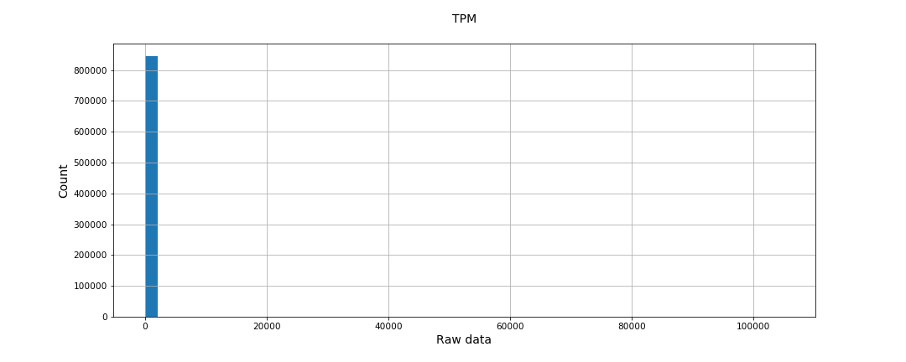
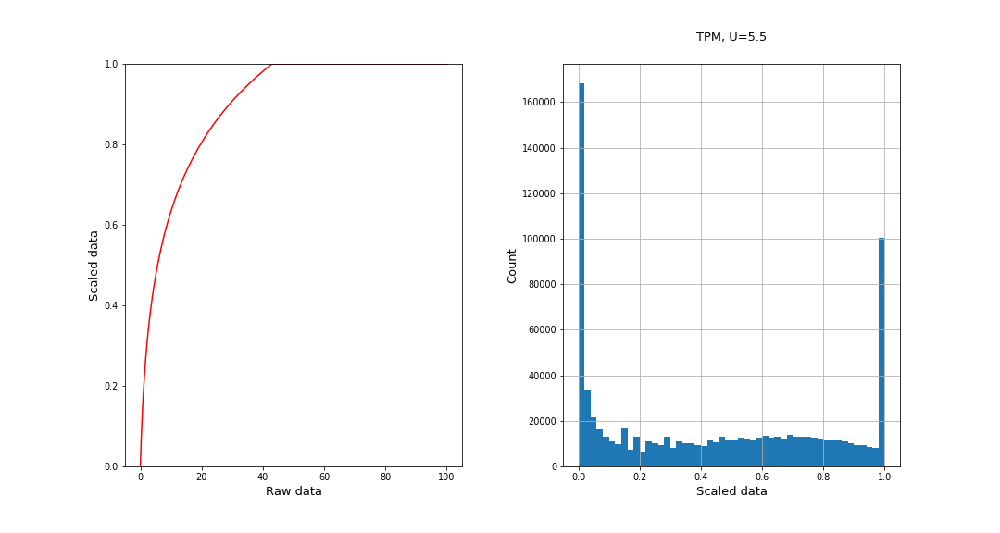

## Introduction

In [Metabolic Atlas](https://github.com/MetabolicAtlas/MetabolicAtlas), the visualization of components, such as in the Map Viewer, can be customized using [Data overlay](https://metabolicatlas.org/documentation#Data-overlay).

For each integrated model, Data overlay allows for multiple data types, such as Transcriptomics and Metabolomics. Each data type allows for multiple data sources, as well as the option for the user to upload and use their custom data on the fly. Each data source can contain multiple datasets, which contain values to be used to customize the visualization.

## Data source file requirements

- File format: [`tsv`](https://en.wikipedia.org/wiki/Tab-separated_values)
- 1st row: This is the header of the file.
  - 1s column: `id`
  - 2nd-nth columns: each subsequent column should contain the name of the dataset
- 2nd-nth rows: each row should contain values that correspond to the header (1st row)
  - 1st column: component identifier
  - 2nd-nth columns: a decimal value between 0 and 1

### Example data source file contents

| id              | adipose tissue | adrenal gland |
| --------------- | -------------- | ------------- |
| ENSG00000000419 | 0.456          | 0.697         |
| ENSG00000000938 | 0.291          | 0.57          |

### The 0-1 range

When one dataset is selected in the Data overlay, each value in the 0-1 range corresponds to a color in the following spectrum.


The requirement for all values to be in the 0-1 range is to ensure values from different data sources can be handled the same way by the visualization component.

When adding new data sources, it is important to inspect the range of the values. For example, if all of the values are within 0.01 and 0.02, only a small segment of the color spectrum will be used. Similarly, for uneven distribution, e.g. if 50% of the data is within 0.01 - 0.02 and 30% is within 0.98 - 0.99, the same visualization problem would be encountered.
Ideally, the minimum value of the data source should be as close to 0 as possible, while the maximum value should be as close to 1 as possible, with as even distribution as possible between for the rest of the values.

Data overlay also allows for two datasets to be selected at the same time. When this is the case, the following spectrum is used instead.


### Scaling of gene expression levels from Human Protein Atlas

The gene expression levels used in [Data overlay](https://metabolicatlas.org/documentation#Data-overlay) for the Human-GEM are obtained from the [Human Protein Atlas](https://www.proteinatlas.org/) (HPA), more specifically, the TPM (transcripts per million) data from the file [rna_tissue_hpa.tsv](https://www.proteinatlas.org/download). However, the raw data from HPA is logarithmic, which means the absolute majority of data are clustered in a very narrow bin in the distribution as shown in the figure below.



Therefore if we map the raw HPA data to the range of 0-1 linearly, almost all scaled data will be close to zero. This makes the separation of genes by their expression levels with Data overlay ineffective. Due to the fact that the raw data is logarithmic, the following equation is used to map the raw data to the range of 0-1:
```
scaled_data = min(1, log2(raw_data + 1)/U)

```
where `U` is defined as
```
U = UQ + 1.5*IQR
```
where `UQ` stands for Upper Quartile and `IQR` stands for InterQuartile Range.

As shown by the figure below, the histogram of scaled data is more evenly distributed in the range of 0-1.



## Folder structure and naming conventions

All data source files should be stored in the [data-files repo](https://github.com/MetabolicAtlas/data-files).

Under each folder in [`/integrated-models`](https://github.com/MetabolicAtlas/data-files/tree/main/integrated-models), there should be a `dataOverlay` folder, for example: `data-files/integrated-models/Human-GEM/dataOverlay`. If not, it means the model currently does not have any data sources for data overlay and the `dataOverlay` folder should be added.

Inside of the `dataOverlay` folder, there could be one or more folders, where the name of each folder should be the data type. Currently, the types `transcriptomics` and `metabolomics` are supported.

Inside of a data type folder, there could be one or more data source files, such as `hpa.tsv`. There should also be an `index.tsv` file, which contains the metadata for all of the data sources in this folder. When adding a new data source, a new row should be added to the `index.tsv` file with the following values:

- `filename`: name of the new data source file without the extension, for example: `hpa` for `hpa.tsv`
- `name`: name of the data source to be displayed to the end user, for example: `The Human Protein Atlas`
- `link`: website of the data source, for example: `https://www.proteinatlas.org`
- `lastUpdated`: date for when the data source was last updated in `YYYY-MM-DD` format, for example: `2021-08-01`

## Adding a new data source

When incorporating new data sources, it should be done via a pull request in the [data-files repo](https://github.com/MetabolicAtlas/data-files). The above rules and conventions about data format as well as folder structure should be followed.

To validate the data to be added, please try to load it as custom expression data at the [data overlay functionality](https://metabolicatlas.org/explore/Human-GEM/map-viewer/golgi_apparatus?dim=2d&panel=1) of Metabolic Atlas. If no errors are reported, the data is formatted correctly.

If it is difficult to establish how to transform the values into the 0-1 scale, please add a note about this in the pull request description and [set the pull request to `draft` mode](https://github.blog/2019-02-14-introducing-draft-pull-requests/).
